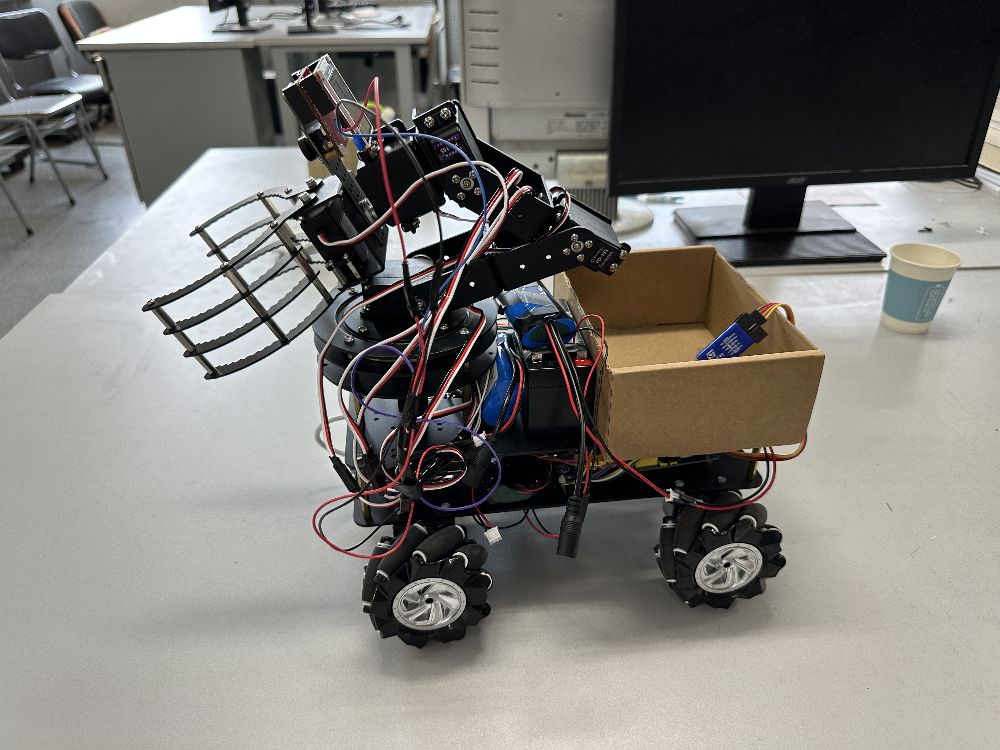
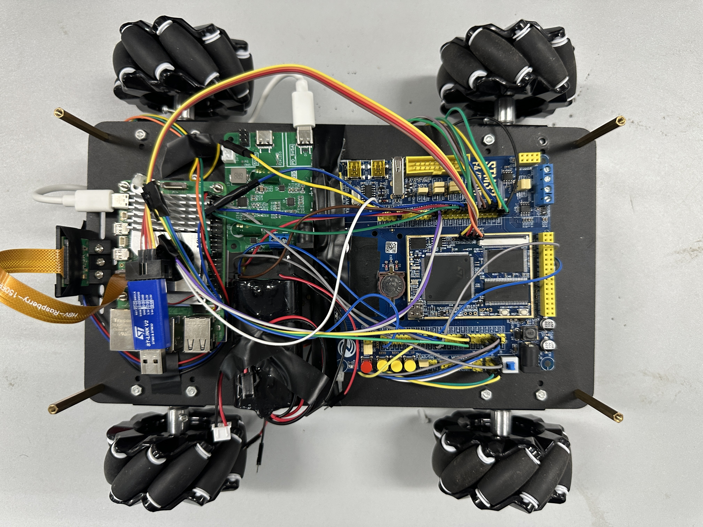
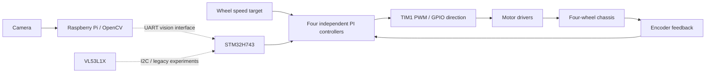
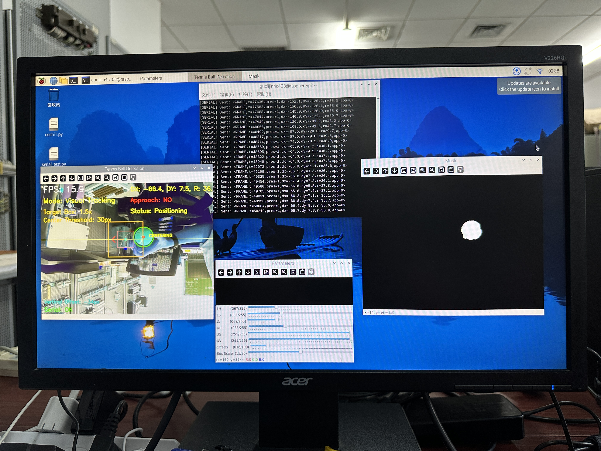
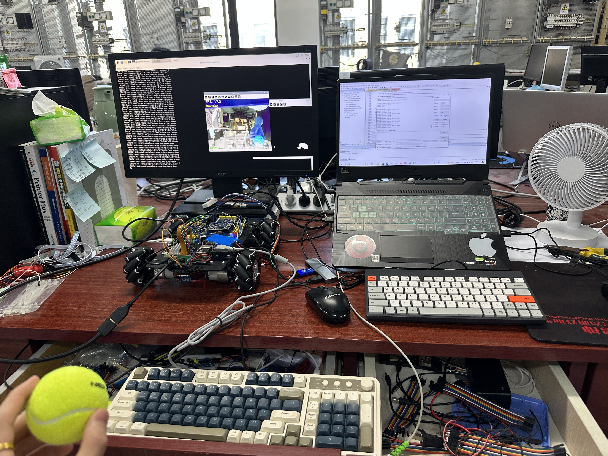

# STM32H7 Tennis Ball Picking Car

A tennis-ball collection prototype combining Raspberry Pi vision, STM32H743 motor control, and a four-wheel chassis with a mounted gripper.

## Overview

The Raspberry Pi uses a camera and OpenCV to detect tennis balls and produce position data for UART transmission. The STM32H743 chassis firmware uses four encoder channels and independent PI controllers to drive the wheels through PWM and direction outputs.

The **current baseline** contains the binary vision transmitter and a four-wheel speed-control test. **Legacy experiments** preserve an earlier ASCII interface, autonomous-search state machine, and VL53L1X-assisted approach logic. The physical prototype also includes a servo arm, gripper, and collection box.

## Hardware Prototype

<p align="center">
  
</p>

*Vehicle prototype with a mecanum-wheel chassis and a mounted servo arm.*

| Component | Role |
| --- | --- |
| STM32H743 | Chassis control and peripheral interfaces |
| Raspberry Pi and camera | Image capture and ball detection |
| Four-wheel chassis and encoder motors | Vehicle motion and wheel feedback |
| Motor drivers | PWM-controlled motor actuation |
| VL53L1X ToF sensor | Ranging in legacy approach experiments |
| Servo arm, gripper, and collection box | Prototype pickup and collection hardware |
| Battery and power system | Onboard power supply |

<p align="center">
  
</p>

*Chassis electronics, including the STM32 board, Raspberry Pi, camera connection, and power wiring.*

## System Architecture



The diagram shows the module design. The current baseline provides separate vision-transmission and wheel-speed-control programs; the legacy directory contains the earlier UART-driven motion experiments.

## Raspberry Pi Vision

Source: [`raspberry_pi/tennis_vision.py`](raspberry_pi/tennis_vision.py)

- Picamera2 image capture at 640 × 480.
- HSV segmentation with adjustable thresholds and morphological filtering.
- Contour selection using area, circularity, and radius constraints.
- Ball-center estimation and extraction of `presence`, `dx`, `dy`, and pixel `radius`.
- Adjustable vertical center offset, detection preview, and mask display.
- Queued UART output using compact binary frames.

`dx` and `dy` are the adjusted image-center coordinates minus the detected ball-center coordinates. The radius is measured in image pixels.

## STM32H7 Chassis Control

Source: [`stm32h7/Core/Src/main.c`](stm32h7/Core/Src/main.c)

- Four encoder channels using TIM3, TIM4, TIM5, and TIM8.
- Independent wheel PI controllers with integral and output limiting.
- Encoder direction correction and PWM dead-zone compensation.
- Four TIM1 PWM outputs and GPIO direction control.
- USART1 telemetry containing the target and four measured wheel values.

The baseline runs a fixed-target wheel-speed test. Feedback values are encoder counts per sampling interval, with a 100 ms delay in the control loop.

## UART Communication

The current vision transmitter uses **115200 baud, 8 data bits, no parity, and 1 stop bit** on `/dev/serial0`.

Each vision packet is 10 bytes:

| Field | Size | Encoding |
| --- | --- | --- |
| Header | 2 bytes | `0x55 0xAA` |
| Presence | 1 byte | `0` or `1` |
| dx | 2 bytes | Signed 16-bit integer |
| dy | 2 bytes | Signed 16-bit integer |
| Radius | 2 bytes | Unsigned 16-bit integer |
| Checksum | 1 byte | Sum of the seven data bytes, modulo 256 |

Multibyte fields use little-endian order. Image measurements are converted to integers before packing. The transmitter schedules packets no more frequently than once every 50 ms.

## Legacy Autonomous Search Experiment

An earlier experimental implementation explored ASCII vision frames, state-machine-based motion control, and VL53L1X ranging. Its states include `SEARCH`, `CENTERING`, `APPROACH`, `LASER_GUIDED`, and `SUCCESS`.

The corresponding programs are preserved in [`legacy/raspberry_pi_ascii/`](legacy/raspberry_pi_ascii/) and [`legacy/stm32_auto_search/`](legacy/stm32_auto_search/) as historical experiments, separate from the current baseline.

<p align="center">
  
</p>

*Legacy vision experiment with tennis-ball localization, HSV segmentation, and ASCII serial output.*

## Hardware Demonstration

[**Watch the prototype demonstration →**](docs/media/tennis_ball_pickup_demo.mp4)

*Prototype vehicle approach, ball pickup and collection demonstration.*

The video shows vehicle motion, gripper pickup, and placement into the collection box, with manual ball repositioning during the test. It documents the hardware prototype; arm/gripper control software is outside this repository.

<details>
<summary>Bench setup</summary>

<p align="center">
  
</p>

*Bench setup for camera-based ball detection and STM32 firmware development.*

</details>

## Repository Structure

```text
.
├── raspberry_pi/                # Current vision program
├── stm32h7/                     # Current H743 chassis-control baseline
│   ├── Core/                    # Application and peripheral configuration
│   ├── MDK-ARM/                 # Keil project, startup, and VL53L1X files
│   └── VL53L1X+L298N+4JGB.ioc   # STM32CubeMX configuration
├── legacy/
│   ├── raspberry_pi_ascii/      # Earlier ASCII vision program
│   └── stm32_auto_search/       # Historical search/approach experiments
├── docs/
│   ├── images/                  # Hardware and experiment photos
│   └── media/                   # Prototype demonstration video
└── .gitignore
```

## Development Environment

- **Firmware:** STM32CubeMX and Keil MDK.
- **Vision:** Python, Picamera2, OpenCV, NumPy, imutils, and pyserial.
- **External SDK:** STM32CubeH7 HAL/CMSIS and the applicable Keil device pack. The Keil projects retain their original `Drivers/` references; the SDK sources are not bundled here.

The repository includes project-specific VL53L1X platform adaptation alongside ST sensor API files and STM32-generated support code. Original third-party copyright notices are retained.
