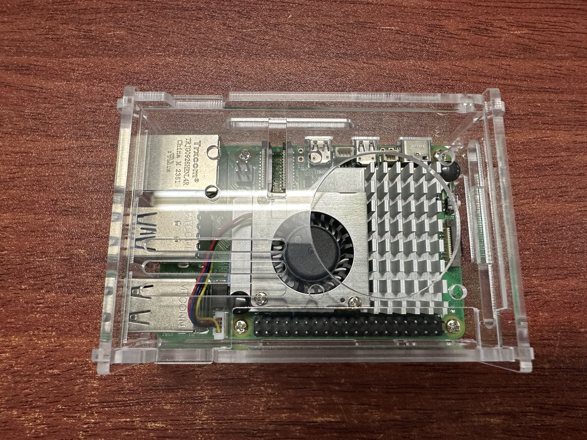
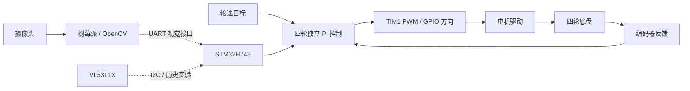
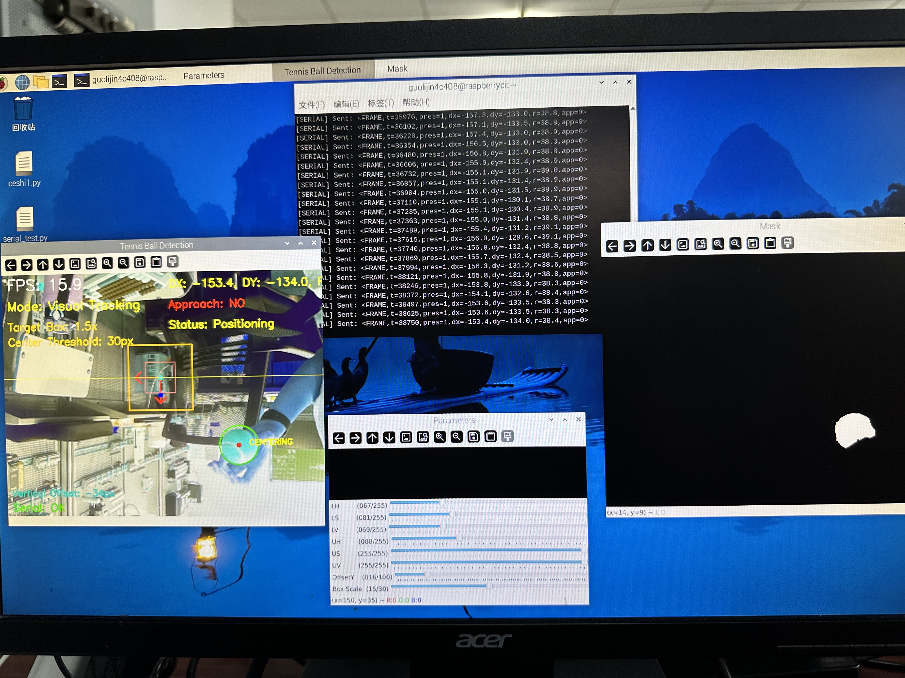
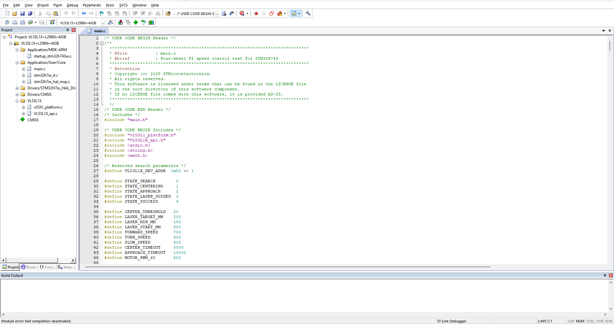

# 基于 STM32H7 与树莓派的网球捡拾小车

结合树莓派视觉识别、STM32H743 四轮底盘控制与机械夹取结构的网球捡拾小车原型。项目包含 OpenCV 网球检测、UART 视觉数据传输、编码器反馈与四轮独立 PI 速度控制，以及早期自动寻球实验。

## 整机与实机视频

[](docs/media/tennis_ball_pickup_demo.mp4)

**[▶ 点击查看实机视频：小车接近、网球夹取与收集](docs/media/tennis_ball_pickup_demo.mp4)**

整机采用四轮麦克纳姆轮底盘，安装机械臂、夹爪与收集盒。视频展示小车运动、夹起网球并放入收集盒的过程，测试中有人手调整球的位置。机械臂控制程序未包含在本仓库中。

## 项目概览

树莓派通过摄像头采集图像，使用 OpenCV 提取网球位置与像素半径，并通过 UART 输出视觉数据。STM32H743 负责底盘控制，通过四路编码器反馈和独立 PI 控制器调节各轮 PWM，使用 GPIO 控制电机方向。

仓库按两个开发阶段组织：**当前开发基线**包含二进制视觉发送程序和四轮 PI 速度测试程序；**历史实验**保留 ASCII 通信、自动寻球状态机和 VL53L1X 辅助接近逻辑。

## 硬件平台

<p align="center">
  
</p>

*底盘与板卡布局：STM32 控制板、树莓派、摄像头连接与供电接线。*

| 硬件 | 作用 |
| --- | --- |
| STM32H743 | 底盘控制与外设接口 |
| 树莓派与摄像头 | 图像采集与网球检测 |
| 四轮底盘与编码器电机 | 小车运动与轮速反馈 |
| 电机驱动模块 | 接收 PWM 和方向信号，驱动电机 |
| VL53L1X ToF 传感器 | 历史接近实验中的距离测量 |
| 机械臂、夹爪与收集盒 | 实机夹取与收集结构 |
| 电池与供电模块 | 整机供电 |

### 树莓派实物

<p align="center">
  
</p>

*树莓派与主动散热组件，用于摄像头图像处理。*

## 系统架构



架构图表达模块设计关系。当前基线分别提供视觉发送与轮速控制程序；基于 UART 视觉数据驱动运动的早期实验保存在 `legacy/` 中。

## 树莓派视觉识别

源码：[`raspberry_pi/tennis_vision.py`](raspberry_pi/tennis_vision.py)

- 使用 Picamera2 采集 640 × 480 图像。
- 通过 HSV 阈值分割、中值滤波及形态学处理提取候选区域。
- 根据轮廓面积、圆度与半径范围筛选网球。
- 提取目标存在标志、`dx`、`dy` 与像素半径 `radius`。
- 支持 HSV 阈值、垂直中心偏移调节，以及识别画面和掩膜显示。
- 通过发送队列与串口线程输出二进制视觉数据。

`dx`、`dy` 为补偿后的图像中心坐标减去网球中心坐标；`radius` 的单位为像素。

### 视觉调试画面

<p align="center">
  
</p>

*历史视觉实验：网球轮廓定位、HSV 分割结果与 ASCII 串口输出。*

<p align="center">
  
</p>

*另一组目标位置下的视觉检测与参数调试画面。以上两张为历史 ASCII 程序的运行记录。*

## STM32H7 底盘控制

源码：[`stm32h7/Core/Src/main.c`](stm32h7/Core/Src/main.c)

- TIM3、TIM4、TIM5、TIM8 四路编码器计数。
- 四轮独立 PI 控制，包含积分限幅与输出限幅。
- 编码器方向修正与 PWM 死区补偿。
- TIM1 四路 PWM 输出及 GPIO 方向控制。
- USART1 输出目标值和四轮反馈值，便于串口观察。

当前主循环执行固定目标轮速测试。反馈值为采样窗口内的编码器计数，循环中包含 100 ms 延时。

### Keil 工程界面

<p align="center">
  
</p>

*Keil 工程结构与四轮 PI 速度控制主程序。*

## UART 通信

当前树莓派视觉发送程序使用 `/dev/serial0`，通信配置为 **115200 波特率、8 数据位、无校验、1 停止位（8N1）**。

视觉数据采用 10 字节定长二进制帧：

| 字段 | 长度 | 格式 |
| --- | --- | --- |
| 帧头 | 2 字节 | `0x55 0xAA` |
| 目标存在标志 | 1 字节 | `0` 或 `1` |
| dx | 2 字节 | 有符号 16 位整数 |
| dy | 2 字节 | 有符号 16 位整数 |
| radius | 2 字节 | 无符号 16 位整数 |
| checksum | 1 字节 | 七个数据字节之和的低 8 位 |

多字节字段使用小端序，图像测量值转为整数后打包。程序将发送间隔限制为至少 50 ms。

## 历史自动寻球实验

早期实验探索了 ASCII 视觉数据、状态机运动控制及 VL53L1X 测距辅助接近。代码包含 `SEARCH`、`CENTERING`、`APPROACH`、`LASER_GUIDED` 和 `SUCCESS` 状态。

对应程序保存在 [`legacy/raspberry_pi_ascii/`](legacy/raspberry_pi_ascii/) 与 [`legacy/stm32_auto_search/`](legacy/stm32_auto_search/)，作为历史实验实现，与当前开发基线分开组织。

## 整体调试环境

<p align="center">
  
</p>

*整体调试环境：小车硬件、树莓派视觉显示与 STM32 开发环境。*

## 仓库结构

```text
.
├── raspberry_pi/                # 当前树莓派视觉程序
├── stm32h7/                     # 当前 H743 底盘控制基线
│   ├── Core/                    # 应用源码与外设配置
│   ├── MDK-ARM/                 # Keil 工程、启动文件及 VL53L1X 项目文件
│   └── VL53L1X+L298N+4JGB.ioc   # STM32CubeMX 配置
├── legacy/
│   ├── raspberry_pi_ascii/      # 早期 ASCII 视觉程序
│   └── stm32_auto_search/       # 历史自动寻球与接近实验
├── docs/
│   ├── images/                  # 整机、硬件及调试图片
│   └── media/                   # 实机演示视频
└── .gitignore
```

## 开发环境

- **STM32 开发：**STM32CubeMX、Keil MDK。
- **树莓派视觉：**Python、Picamera2、OpenCV、NumPy、imutils、pyserial。
- **外部 SDK：**STM32CubeH7 HAL/CMSIS 与适用的 Keil 器件包。工程保留原 `Drivers/` 引用，仓库未附带整套 SDK。

仓库保留 VL53L1X 平台适配代码、ST 传感器 API 与 STM32 自动生成的支持代码，并保留第三方原始版权声明。
